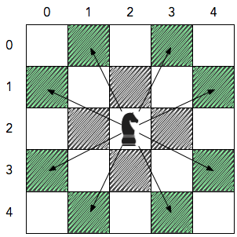

## Problem: KnightL on a Chessboard

KnightL is a chess piece that moves in an L shape. 
We define the possible moves of KnightL(a,b) as any movement from some position (x1,y1) to some (x2,y2) to 
some satisfying either of the following:

* x2 = x1 ± and a, y2 = y1 ± and b or
* x2 = x1 ± +b and , or y2 = y1 ± a


Note that (a,b) and (b,a) allow for the same exact set of movements. 
For example, the diagram below depicts the possible locations that KinightL(1,2) or 
Knight(2,1) can move to from its current location at the center of 5 x 5 a chessboard:




Observe that for each possible movement, the Knight moves 2 units in one direction (i.e., horizontal or vertical) and 1 unit in the perpendicular direction.

Given the value of n for an n x n chessboard, answer the following question for each (a,b) pair where 1 <= a,b < n:

* What is the minimum number of moves it takes for KnightL(a,b) to get from position (0,0) to position (n-1,n-1) ? If it’s not possible for the Knight to reach that destination, the answer is -1 instead.

Then print the answer for each KnightL according to the Output Format specified below.

## Input Format
A single integer denoting .

## Constraints
5 ≤ n ≤ 25

## Output Format

Print exactly n-1 lines of output in which each line i (where 1 ≤ i < n ) n-1 contains space-separated integers describing the minimum number of moves KnightL(i,j) must make for each respective j (where 1 ≤ i < n ). If some KnightL(i,j) cannot reach position (n-1,n-1), print -1 instead.

For example, if n=3 we organize the answers for all the (i,j) pairs in our output like this:

```
(1,1) (1,2)
(2,1) (2,2)
```
## Sample Input 0
```
5
```
## Sample Output 0

```
4 4 2 8
4 2 4 4
2 4 -1 -1
8 4 -1 1
```


for more information about the problem pleae check the folowing link.
https://www.hackerrank.com/contests/rookierank-2/challenges/knightl-on-chessboard